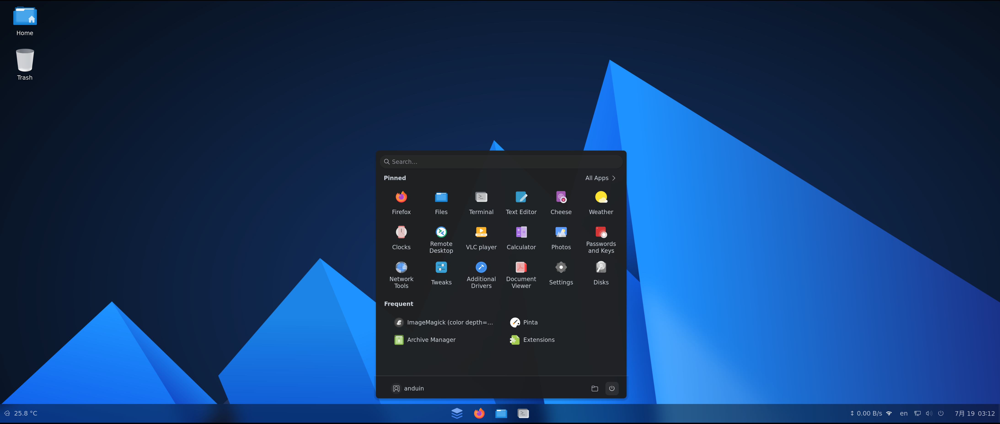

# AnduinOS

[](https://gitlab.aiursoft.cn/anduin/anduinos/-/blob/1.3/LICENSE)
[](https://github.com/Anduin2017/AnduinOS/discussions)
[](https://www.anduinos.com/)
[](https://gitlab.aiursoft.cn/anduin/anduinos/-/commits/1.3?ref_type=heads)


AnduinOS is a custom Ubuntu-based Linux distribution that offers a familiar and easy-to-use experience for anyone moving to Linux.

[Download AnduinOS](https://www.anduinos.com/)



## How to build

You MUST be using an `AMD64` architecture to build AnduinOS.

To edit the build parameters, modify the `./src/args.sh` file.

The first two parts of the `TARGET_BUILD_VERSION` MUST be the same as the git branch name. For example:

```bash
TARGET_BUILD_VERSION="1.3.0"
```

Then the git branch name MUST be `1.3`.

To build the OS, run the following command:

```bash
cd ./src
./build.sh
```

That's it. The built file will be an ISO file in the `./src/dist` directory.

Simply mount the built ISO file to an virtual machine, and you can start installing it.

## Document

[Read the document](https://docs.anduinos.com/)

## License

This project is licensed under the GNU GENERAL PUBLIC LICENSE - see the [LICENSE](LICENSE) file for details

The open-source software included in AnduinOS is distributed in the hope that it will be useful, but WITHOUT ANY WARRANTY.

[List of open-source software included in AnduinOS](OSS.md)

## Support

For community support and discussion, please join our [AnduinOS Discussions](https://github.com/Anduin2017/AnduinOS/discussions).

For bug reports and feature requests, please use the [Issues](https://github.com/Anduin2017/AnduinOS/issues) page.

<!-- Planned future work:

* ARM support.
* WSL support.
* Docker container support.
* Customized installer instead of ubiquity.
* Customized apt source with our own override.
* Customized kernel with our own override. -->